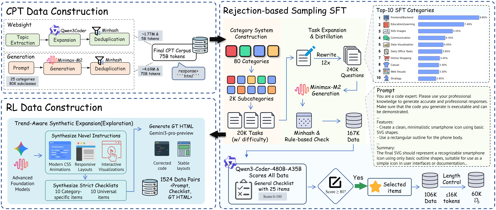
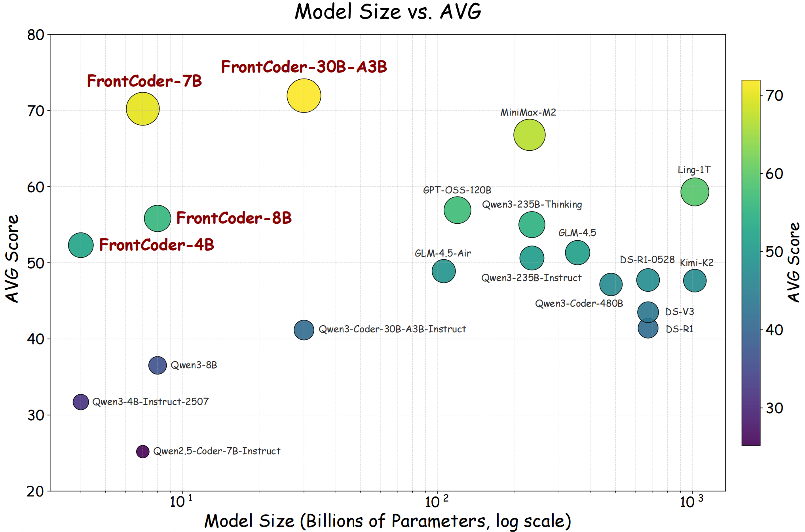

<div align="center">

  <h1 style="margin: 0; font-size: 2.2em;">
    🎨 FrontCoder: Scaling Visual Fidelity in Front-End Code Generation
  </h1>

  <p style="font-size: 1.2em; color: #666; margin-top: 0.5em;">
    Specialized Code Generation Model for Front-End Development
  </p>

  [](https://arxiv.org/abs/XXXX.XXXXX)
  [](https://github.com/leanfeng1/FrontCoder)

</div>

## 📚 Overview

- [📚 Overview](#-overview)
- [⚡ News](#-news)
- [🎁 Available Resources](#-available-resources)
  - [📦 Released Models](#-released-models)
  - [📊 Released Datasets](#-released-datasets)
- [📖 Introduction](#-introduction)
- [🏗️ Training Pipeline](#️-training-pipeline)
- [📂 Repository Structure](#-repository-structure)
- [🚀 Getting Started](#-getting-started)
- [💾 Data Construction](#-data-construction)
- [🎯 Training](#-training)
- [📊 Evaluation](#-evaluation)
- [🧪 Example Usage](#-example-usage)
- [📮 Contact](#-contact)
- [📄 Citation](#-citation)

## ⚡ News

- [2026/04/14] 🔥 **FrontCoder** training code, data pipelines, SFT&RL data, models released!
- [2025/04/14] 🎉 Our model FrontCoder-30B-A3B achieves the best performance of open-source models on front-end code generation benchmark ArtifactsBench.
- [2025/04/06] 🎉 Our paper "FrontCoder: Scaling Visual Fidelity in Front-End Code Generation" has been accepted for publication in ACL 2026 Findings.

## 🎁 Available Resources

### 📦 Released Models

| Model | Size | HuggingFace Link | Description |
|-------|------|------------------|-------------|
| **FrontCoder-4B** | 4B | [🤗 FrontCoder-4B](https://huggingface.co/leanfeng1/FrontCoder-4B) | Compact model for efficient deployment |
| **FrontCoder-7B** | 7B | [🤗 FrontCoder-7B](https://huggingface.co/leanfeng1/FrontCoder-7B) | Balanced performance and efficiency |
| **FrontCoder-8B** | 8B | [🤗 FrontCoder-8B](https://huggingface.co/leanfeng1/FrontCoder-8B) | Enhanced capabilities for complex tasks |
| **FrontCoder-30B-A3B** | 30B-A3B | [🤗 FrontCoder-30B-A3B](https://huggingface.co/leanfeng1/FrontCoder-30B-A3B) | **Best performance of open-source models** on ArtifactsBench |

### 📊 Released Datasets

| Dataset | Size | HuggingFace Link | Description |
|---------|------|------------------|-------------|
| **FrontCoder-SFT** | 60K samples | [🤗 FrontCoder-SFT](https://huggingface.co/datasets/leanfeng1/FrontCoder-SFT) | High-quality instruction-following data for supervised fine-tuning |
| **FrontCoder-RL** | 398 triplets (subset) | [🤗 FrontCoder-RL](https://huggingface.co/datasets/leanfeng1/FrontCoder-RL) | Vision-grounded reward data for reinforcement learning |

## 📖 Introduction

**FrontCoder** is a specialized code generation model fine-tuned for front-end web development. It excels at generating high-quality HTML, CSS, and JavaScript code from natural language descriptions.

### 🔑 Key Features

1. **Three-Stage Training Pipeline**: Combines Continual Pre-training (CPT), Supervised Fine-tuning (SFT), and Reinforcement Learning (RL) for optimal performance

2. **Large-Scale Data Construction**:
   - **CPT**: 75B tokens of domain-specific front-end code
   - **SFT**: 60K high-quality instruction-following samples
   - **RL**: Vision-grounded reward optimization with GRPO

3. **Comprehensive Quality Control**:
   - MinHash deduplication for data quality
   - 25-dimension quality scoring system
   - Vision-grounded checklist evaluation

4. **Production-Ready Code**: Generates complete, executable web applications with proper structure and best practices

---

### 📊 Overview Figures

#### Figure 1: Three-Stage Data Construction Pipeline


**Overview of our three-stage data construction pipeline for front-end code generation.** We construct $\mathcal{D}$ via: (i) **CPT**, combining WebSight rewriting and large-scale synthetic generation, then deduplicating and applying regex/rule-based corpus sanitation to obtain the final $\mathcal{D}_{C}$ corpus (75B tokens); (ii) **SFT**, using rejection-based sampling (MinHash near-duplicate removal, rule-based validation, and Qwen3-Coder-480B-A35B semantic scoring with a strict $S \ge 80$ threshold) to obtain a length-controlled set of 60K high-quality instruction-code pairs $\mathcal{D}_{S}$; and (iii) **RL**, using trend-aware synthetic expansion to synthesize novel instructions and strict 20-item checklists, generating 398 high-fidelity data triplets (subset) for structured reward specification $\mathcal{D}_{R}$.

#### Figure 2: RL Training Pipeline


**Overview of the RL training pipeline.** The process consists of rollout generation, multi-step preprocessing (repetition and rendering checks), reward calculation using a VLM-based checklist and similarity metrics, and a final policy update based on the aggregated rewards.

#### Figure 3: Performance Benchmark Results


**Performance of various models on the ArtifactsBench**, evaluated across five front-end code generation task categories (GAME, SVG, WEB, SI: Simulation, MS: Management System). The table compares both closed-source and open-source models, including our proposed **FrontCoder**. **IFLEN** (Inference Length) represents the average length of the generated code response and serves as a proxy for generation efficiency; since the reasoning chain length is not accessible for certain closed-source models, this field is left empty for them. The columns under **SCORE** report results on each task category, and **AVG** denotes the overall average score on the entire benchmark. The best score in comparison on baselines group is marked in **bold**, and the next best score is underlined. Values marked with -- are not publicly disclosed by the official benchmark and models.

---

## 🏗️ Training Pipeline

FrontCoder is trained using a three-stage approach:

### Stage 1: Continual Pre-training (CPT) 🧠

Domain-specific pre-training on 75B tokens of front-end code and documentation.

**Data Composition:**
- **WebSight Rewriting** (5B tokens): VLM-analyzed screenshots with L1/L2 prompt expansion
- **Large-scale Synthesis** (70B tokens): Hierarchical prompt generation using MiniMax-M2

### Stage 2: Supervised Fine-tuning (SFT) 📝

Instruction tuning with 60K high-quality samples filtered through:
1. **Task Definition**: 80 categories and 20K subcategories
2. **Prompt Expansion**: 20K × 12 variants = 240K raw samples
3. **Three-Stage Filtering**:
   - MinHash deduplication (Jaccard threshold 0.7)
   - Rule-based validation
   - Model-based scoring (Qwen3-Coder-480B-A35B-Instruct, 25 dimensions)
4. **Final Selection**: Top 60K by quality score

### Stage 3: Reinforcement Learning (RL) 🎯

GRPO training with vision-grounded composite reward:

```
R(y) = I_rep(y) × I_render(y) × (α × S_chk + β × S_sim + γ × S_len)
```

Where:
- `I_rep`: Repetition indicator (0/1)
- `I_render`: Render success indicator (0/1)
- `S_chk`: VLM checklist score (0-5, 20 items)
- `S_sim`: Similarity score = 0.5 × S_struct + 0.5 × S_sem
- `S_len`: Length score (L_min=12K, L_max=16K tokens)
- Weights: α=0.6, β=0.3, γ=0.1

## 📂 Repository Structure

```
FrontCoder/
├── data_construction/          # Data generation pipelines
│   ├── cpt/                    # CPT data generation
│   │   ├── generate_syn1_category_tree.py
│   │   ├── generate_syn2_prompt_templates.py
│   │   ├── generate_syn3_prompts_from_categories.py
│   │   ├── generate_syn4_html_minimax.py
│   │   ├── generate_websight_expansion.py
│   │   └── generate_cpt_dedup.py
│   │
│   ├── sft/                    # SFT data generation
│   │   ├── generate_sft1_expand_tasks.py      # 2K → 20K tasks
│   │   ├── generate_sft2_variants.py          # 20K → 240K variants
│   │   ├── generate_sft3_code_minimax.py      # Code generation
│   │   ├── generate_sft4_dedup.py             # MinHash deduplication
│   │   ├── generate_sft5_scorer.py            # 25-D quality scoring
│   │   ├── generate_sft6_filter.py            # Final filtering
│   │   └── utils.py                           # Utility functions
│   │
│   └── rl/                     # RL data generation
│       ├── generate_from_trending_demos_1.py
│       ├── generate_html_with_gemini_2.py
│       ├── filter_valid_html_3.py
│       └── convert_to_grpo_format_4.py
│
├── training/                   # Training scripts
│   ├── sft/                    # SFT training
│   │   ├── run_sft.sh          # Training launch script
│   │   └── sft_config.yaml     # Training configuration
│   │
│   └── rl/                     # RL training (GRPO)
│       ├── run_grpo.sh         # GRPO training script
│       ├── reward/             # Reward function
│       │   └── html_reward.py  # Composite reward implementation
│       └── render_service/     # HTML rendering service
│           ├── html_render_service.py
│           └── start_render_service.sh
│
├── README.md                   # This file
└── requirements.txt            # Python dependencies
```

## 🚀 Getting Started

### 🔧 Installation

```bash
# Clone the repository
git clone https://github.com/leanfeng1/FrontCoder.git
cd FrontCoder

# Create conda environment
conda create -n frontcoder python=3.10 -y
conda activate frontcoder

# Install dependencies
pip install -r requirements.txt
```

### 📦 Requirements

**Hardware:**
- 8× H800/A100 GPUs (80GB) for training
- CPU node with 256+ cores for render service

**Software:**
```bash
pip install torch==2.9.0 transformers accelerate
pip install verl                          # Training framework
pip install playwright fastapi uvicorn   # Render service
pip install pandas pyarrow                # Data processing
pip install openai aiohttp                # API clients
```

**Services:**
- VLM service (Qwen2.5-VL-72B recommended) for checklist scoring
- HTML render service (included in this repo)

## 💾 Data Construction

> **💡 Quick Start:** You can directly use our released datasets from HuggingFace:
> - [FrontCoder-SFT](https://huggingface.co/datasets/leanfeng1/FrontCoder-SFT) (60K samples)
> - [FrontCoder-RL](https://huggingface.co/datasets/leanfeng1/FrontCoder-RL) (398 triplets subset)
>
> The instructions below are for reproducing the data construction pipeline from scratch.

### Stage 1: CPT Data Generation

```bash
# Generate L1 seed tasks from WebSight
python data_construction/cpt/generate_websight_expansion.py \
    --input websight_data.jsonl \
    --output cpt_websight.jsonl

# Generate hierarchical prompts
python data_construction/cpt/generate_syn1_category_tree.py \
    --output category_tree.json

python data_construction/cpt/generate_syn2_prompt_templates.py \
    --input category_tree.json \
    --output prompt_templates.jsonl

python data_construction/cpt/generate_syn3_prompts_from_categories.py \
    --input prompt_templates.jsonl \
    --output prompts_expanded.jsonl

# Generate HTML code
python data_construction/cpt/generate_syn4_html_minimax.py \
    --input prompts_expanded.jsonl \
    --output cpt_code.jsonl \
    --api_key YOUR_API_KEY

# Deduplicate
python data_construction/cpt/generate_cpt_dedup.py \
    --input cpt_code.jsonl \
    --output cpt_deduped.jsonl \
    --threshold 0.7
```

### Stage 2: SFT Data Generation

```bash
# Step 1: Expand to 20K tasks (2K → 20K)
python data_construction/sft/generate_sft1_expand_tasks.py \
    --input_file sft_subcategories_2k.jsonl \
    --output_file sft_tasks_20k.jsonl \
    --workers 50

# Step 2: Generate variants (20K → 240K)
python data_construction/sft/generate_sft2_variants.py \
    --input_file sft_tasks_20k.jsonl \
    --output_file sft_variants_240k.jsonl \
    --workers 30

# Step 3: Generate code
python data_construction/sft/generate_sft3_code_minimax.py \
    --input_file sft_variants_240k.jsonl \
    --output_file sft_code_240k.jsonl \
    --workers 100

# Step 4: Deduplicate
python data_construction/sft/generate_sft4_dedup.py \
    --input sft_code_240k.parquet \
    --output sft_deduped.parquet \
    --threshold 0.8

# Step 5: Quality scoring
python data_construction/sft/generate_sft5_scorer.py \
    --input sft_deduped.parquet \
    --output sft_scored.parquet \
    --workers 2000

# Step 6: Filter and select top 60K
python data_construction/sft/generate_sft6_filter.py \
    --input sft_scored.parquet \
    --output sft_final_60k.parquet \
    --min_score 80 \
    --target_count 60000
```

### Stage 3: RL Data Generation

```bash
# Generate hard prompts from trending demos
python data_construction/rl/generate_from_trending_demos_1.py \
    --output hard_prompts.jsonl \
    --count 500

# Generate HTML with VLM
python data_construction/rl/generate_html_with_gemini_2.py \
    --input hard_prompts.jsonl \
    --output prompts_with_html.jsonl

# Filter valid HTML
python data_construction/rl/filter_valid_html_3.py \
    --input prompts_with_html.jsonl \
    --output valid_prompts.jsonl

# Convert to GRPO format
python data_construction/rl/convert_to_grpo_format_4.py \
    --input valid_prompts.jsonl \
    --output rl_data.parquet
```

## 🎯 Training

### SFT Training

```bash
cd training/sft

# Edit sft_config.yaml with your settings
# Then run:
bash run_sft.sh --nproc 8
```

**Key Hyperparameters:**
- Learning rate: 5×10⁻⁵
- Batch size: 128
- Epochs: 2
- Max sequence length: 16,384 tokens

### RL Training (GRPO)

```bash
# Start render service first
cd training/rl/render_service
bash start_render_service.sh

# Start GRPO training
cd ../
bash run_grpo.sh
```

**Key Hyperparameters:**
- Learning rate: 4×10⁻⁶
- Batch size: 256
- KL coefficient: 0.001
- Rollout samples per prompt: 4

## 📊 Evaluation

### 25-Dimension Quality Metrics

| Category | Dimensions |
|----------|------------|
| **Code Quality** | Executability, Completeness, Standards, Engineering |
| **Functionality** | Boundary Handling, Validation, Interaction |
| **User Experience** | Design, Smoothness, Feedback |
| **Response Quality** | Understanding, Rationality, Documentation |
| **Technical Depth** | Tech Selection, Performance, Modern Features |
| **Innovation** | Novel Features, UX Enhancement |
| **Robustness** | Redundancy, Exception Handling |
| **Compatibility** | Cross-platform Support |
| **Accessibility** | A11y Compliance |
| **Maintainability** | Readability, Extensibility |

Each dimension scored 0-10 with 5-level granularity.

## 🧪 Example Usage

```python
from transformers import AutoModelForCausalLM, AutoTokenizer

# Load model (use FrontCoder-7B as example)
model = AutoModelForCausalLM.from_pretrained("leanfeng1/FrontCoder-7B")
tokenizer = AutoTokenizer.from_pretrained("leanfeng1/FrontCoder-7B")

# Generate code
prompt = "Create a responsive navigation bar with dark mode toggle"
inputs = tokenizer(prompt, return_tensors="pt")
outputs = model.generate(**inputs, max_length=16384)
code = tokenizer.decode(outputs[0])

print(code)
```

## 📮 Contact

For questions, feedback, or collaboration opportunities, feel free to reach out:
- Email: leanfeng1@gmail.com
- GitHub Issues: [Create an issue](https://github.com/leanfeng1/FrontCoder/issues)

<!-- ## 📄 Citation

If you use this code or model, please cite our paper:

```bibtex
@article{frontcoder2025,
    title={FrontCoder: Towards Front-end Code Generation},
    author={Jun },
    journal={arXiv preprint arXiv:XXXX.XXXXX},
    year={2025}
}
``` -->

## 🙏 Acknowledgments

- Thanks to the open-source community for the foundational tools and models.

## 📜 License

This project is released under the MIT License.

---

<div align="center">
  <p>Made with ❤️ by the FrontCoder Team</p>
  <p>
    <a href="#-overview">Back to Top</a>
  </p>
</div>
